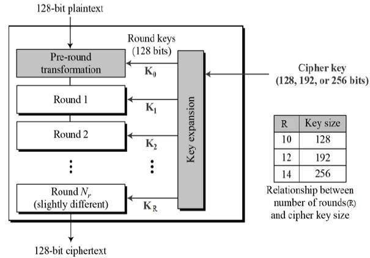

# Advanced Encryption Standard
The Advanced Encryption Standard (AES) is a symmetric block cipher to encrypt sensitive data. This implementation supports a 128-bit key. AES-128 bit requires 10 rounds to complete the full operation. The input data is 128 bits and the input key is also 128-bit and each round requires 1 cycle to complete.

## The schematic of AES structure

### Steps
   * Add round key
   
   * Substitute bytes
   
   * Shift rows
   
   * Mix columns
   

## Building on macOS
1. Icarus-Verilog can be installed via Homebrew :
   <code>$ brew install icarus-verilog</code>
2. Download [Scansion](http://www.logicpoet.com/scansion/) from here.  
3. Clone the repository.
4. Run <code>$ make </code> and type MIPS code to see it in binary form in rams_init_file.hex file. 

5. <code>$ make simulate</code> will: 
* compile design+TB
* simulate the verilog design

6. <code>$ make display</code> will: 
*  display waveforms.
